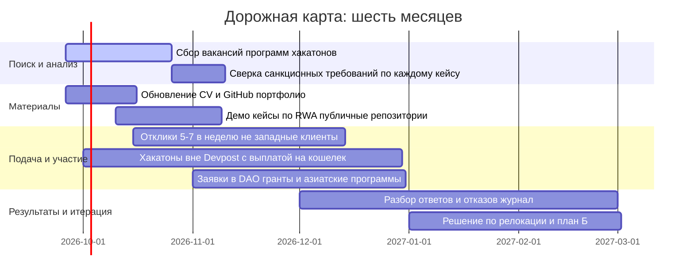

# Крымская изоляция: криптокарьера за «сталинскими» воротами санкций

## Резюме

- **Санкции против меня.** США, ЕС, Великобритания и их сателлиты смотрят на Крым как на территорию, с которой запрещены почти все экономические операции. Формулировка OFAC дословная: *«E.O. 13685 запрещает практически все прямые и косвенные транзакции (включая финансовые, торговые и иные коммерческие операции) лицами США или на территории США с крымской территорией или на неё, если только OFAC не выдал разрешение или это прямо не предусмотрено законом»*. Это не моя интерпретация, это памятка казначейства от 30 июля 2015 года.
- **Разница паспортов.** У меня паспорт РФ, выданный в Крыму. Работодатель из ЕС или США не станет рисковать ради человека с пропиской на оккупированной территории и паспортом страны, против которой введены пакеты санкций. Visa и Mastercard прекратили обслуживание карт в Крыму ещё 26 декабря 2014 года, на следующий день после подписания того самого E.O. 13685.
- **Обмануть проверку трудно.** IP-адрес, мобильный номер с крымским кодом +7 978, часовой пояс, история выездов, язык интервьюера. Официальные правила Devpost прямо перечисляют: *«Russia, Crimea, Cuba, Iran, North Korea, Syria and any other country designated by OFAC»*. Трюк «Simferopol, Ukraine» в резюме проваливается на самом первом скрининге, а сама попытка сокрытия адреса крымчанина в документах числится в публичных advisory OFAC как типовой способ обхода санкций.
- **Но один процент остаётся.** Нестандартные доски задач, азиатские и не-западные контрагенты, оплата кошельком, хакатоны вне Devpost, релокация как инструмент, публичный контент. Реальных публичных кейсов карьеры крымчан в западном веб3 я не нашёл. И это тоже ответ на мой вопрос: поле пустое не потому, что нас нет, а потому, что ворота закрыты документально.
- **Мои семь кейсов.** Ниже разбираю по одному: RockawayX Catapult, хакатоны (Devpost и ETHGlobal Tokyo, который идёт прямо сейчас), гранты (Ethereum Foundation, Gitcoin, погибший Aave Grants DAO), баг-баунти (Immunefi и HackerOne), фриланс и EOR (Deel, Upwork), регистрация компании (РФ, Грузия, Казахстан, Сербия, ОАЭ), поиск работы и инвестиции для своего агентства. Для каждого: реальные документы, ссылки, цепочка «что будет, если я подам заявку сегодня», эмоция и вердикт.
- **Доказательная база.** Штрафы OFAC за обход: Bittrex $24,3 млн, Poloniex $7,6 млн, BitPay $507 тыс. Максимальный гражданский штраф по IEEPA в 2026 году: около $377,7 тыс. за нарушение или двукратная сумма сделки. Уголовно: до $1 млн и 20 лет тюрьмы. Сумма «50 тысяч долларов за перевод», которая фигурировала в моём черновике, ошибочна: реальные цифры куда неприятнее.

---

## Ситуация: кто я и почему мне больно

Я CEO веб3-агентства, занимаюсь токенизацией активов и RWA. Живу в Крыму, работаю удалённо. Web3 я выбирал потому, что вроде бы география там не важна: смарт-контракту всё равно, откуда ты писал код, ему не нужен почтовый индекс.

Оказалось, география не то чтобы не важна. Она стала единственным аргументом.

Когда в январе 2014 года я впервые увидел, как падает курс, я думал, это финал истории. Через двенадцать лет, в сентябре 2026-го, вижу: история геополитики добежала до моего резюме. Моя точка на карте похожа на булыжник, подложенный себе под колесо: вроде мелочь, а весь путь через ров.

Эмоции, если честно, перемешаны как в «Матрице»: злость, что я профессионал в нише, где рынок растёт (по данным на 2026 год, капитализация крипторынка по оценке «Ъ» превышает $2,24 трлн), а фильтр на входе смотрит не на мои кейсы, а на прописку. Обида: «я умею, мне 99% дверей хлопают перед носом». Удивление отсутствия логики: мои клиенты из Казахстана и ОАЭ вообще не подозревают, что я живу за забором. И самоирония, без которой тут не выжить: моей единственной криптовалютой стала крипто-изоляция, держу её холодным кошельком и не конвертирую.

Сравнение с теми, кто не из Крыма, бьёт сильнее всего. Условный Леван из Тбилиси открывает Payoneer за полчаса, регистрируется на Upwork, подаётся на Deel как контрактор, выигрывает хакатон на Devpost и получает приз на карту Bank of Georgia с Mastercard. Условный Аслан из Алматы делает то же самое, и даже Google-конкурсы, которые иногда банят Казахстан, его пускают. Я делаю те же шаги и на каждом третьем получаю отказ с формулировкой «restricted jurisdiction» или молчание. Это не равная конкуренция. Это марафон, где меня поставили на дистанцию с грузом на спине, а потом спрашивают, почему я отстаю.

Метафору придумал для себя давно. Мы со всеми играем в «Papers, Please», только чужой инспектор штампует «approved», а мой штамп уже стоит: погранпост моей жизни работает на опережение.

---

## Фундамент: что реально написано в документах

### E.O. 13685: «закрыто всё»

19 декабря 2014 года президент Обама подписал Executive Order 13685 «Blocking Property and Prohibiting Certain Transactions with Respect to the Crimea Region of Ukraine». Раздел 1(a) запрещает американским лицам новые инвестиции в Крым и импорт, и экспорт любых товаров, услуг или технологий с крымской территорией или на неё, прямо или косвенно. Раздел 6 добавляет антиобходную норму: запрещено и уклонение от запретов, и содействие уклонению, и заговор с этой целью.

Цитата из памятки OFAC (30 июля 2015 года, [Advisory Regarding the Obfuscation of Critical Information](https://ofac.treasury.gov/media/8676/download?inline=)):

> *«Specifically, E.O. 13685 prohibits virtually all direct and indirect transactions (including financial, trade, and other commercial transactions) by U.S. persons or within the United States to or from Crimea unless authorized by OFAC or exempted by statute.»*

Регламент 31 CFR Part 589 (введён в Federal Register 2 мая 2022 года, [Ukraine-/Russia-Related Sanctions Regulations](https://www.federalregister.gov/documents/2022/05/02/2022-09371/ukraine-russia-related-sanctions-regulations)) раскладывает это на части: американцам запрещено предоставлять «юридические, бухгалтерские, финансовые, брокерские, фрахтовые, транспортные, PR-иные или иные услуги любому лицу на территории Крыма», заключать с таким лицом контракты, вести с ним переговоры о контрактах. Разрешено узкое: личные некоммерческие переводы, публикации, сельхоз и медицина, экстренная медиэвакуация, отдельные NGO-программы.

Для меня это означает простую вещь. Американская компания не может нанять меня ни фулл-тайм, ни контрактором, ни «просто платить за консультации». Это не жадность и не политика отдела кадров. Это федеральный закон Соединённых Штатов.

### ЕС: зеркало и ужесточение

Европа пришла к тому же в 2014-м. Council Regulation (EU) No 692/2014 от 23 июня 2014 года запретил импорт товаров из Крыма и Севастополя и связанное с ним финансирование. Council Regulation 825/2014 от 30 июля 2014 года добавил запрет инвестиций и, в частности, дословно: *«It is prohibited to create any joint venture in Crimea or Sevastopol»* (см. [информационную записку ЕК для бизнеса](https://finance.ec.europa.eu/system/files/2020-01/180125-note-business-crimea_en.pdf)).

Дальше ЕС пошёл вширь и вглубь:

- восьмой пакет (октябрь 2022 года) запретил ЕС-лицам предоставлять любые криптокошельки, счета и кастодиальные услуги россиянам независимо от суммы, то есть былую «тысячеевровую» лазейку закрыли ([Decrypt](https://decrypt.co/111389/europe-bans-all-crypto-wallet-services-russia-new-sanctions-package));
- девятнадцатый пакет от 23 октября 2025 года распространил запрет уже на все криптоуслуги как таковые: ЕС-лица не вправе оказывать их «российским гражданам или резидентам» и российским юрлицам ([Skadden](https://www.skadden.com/insights/publications/2025/11/eu-adopts-19th-sanctions-package), [Ashurst](https://www.ashurstperkinscoie.com/en/insights/overview-of-the-eus-19th-sanction-package/)). С 25 ноября 2025 года это в силе, а с 18 января 2026 года вступает в действие ещё и запрет для россиян и резидентов РФ владеть, контролировать или держать позиции в европейских провайдерах кошельков, счетов и кастодиального хранения. Заодно под санкции попали Mir и СБП, стейблкоин A7A5;
- двадцатый пакет (2026 год) ушёл в пол: запрет вообще любых операций с любым криптопровайдером, созданным в России и Беларуси ([TRM Labs](https://www.trmlabs.com/resources/blog/eu-adopts-20th-sanctions-package-on-russia----including-a-sweeping-ban-on-all-crypto-asset-transactions-with-russian-and-belarusian-providers)).

Великобритания после Brexit сделала собственный режим и в мае 2026-го даже добавила [новый пакет санкций по Крыму](https://crimea-platform.org/en/news/united-kingdom-imposes-new-package-of-sanctions-on-individuals-and-entities-connected-to-crimea/). То есть машина не ржавеет, её продолжают смазывать.

### Платёжные рельсы: история одной ночи февраля 2022-го

28 февраля 2022 Wise приостановил все переводы в Россию ([Reuters](https://www.streetinsider.com/Payments+company+Wise+suspends+money+transfer+business+in+Russia/19691559.html)). 5 марта об этом же объявила Payoneer, 6 марта ушла PayPal ([thepaypers](https://thepaypers.com/payments/news/paypal-suspends-its-services-in-russia)). Revolut закрылся для новых российских регистраций. Эти сервисы так и не вернулись: обзоры 2026 года подтверждают, что список «не работает с Россией» не изменился.

С Крымом всё было ещё раньше. Visa и Mastercard объявили о прекращении обслуживания карт в Крыму 26 декабря 2014 года, через неделю после подписания E.O. 13685 ([Reuters](https://www.reuters.com/article/us-russia-crisis-visa-crimea-idUSKBN0K40TN20141226/)). Первый звонок был ещё в марте 2014-го, когда платёжки отключили несколько российских банков Крыма, но декабрьский удар был финальным: с тех пор карты в Крыму это фактически «Пропуск» местного значения.

Криптобиржи ведут себя как более осторожные версии тех же платёжек. В списках запрещённых территорий Binance стоят Крым, Донецк и Луганск ([обзор 2026](https://www.datawallet.com/crypto/binance-restricted-countries)), у Bybit значится даже «Sevastopol, Crimea, Donetsk, Luhansk» ([список Bybit](https://www.cryptowisser.com/guides/where-bybit-is-allowed-complete-country-guide-2025/)), Gate.io закрыт и для Крыма, и для России ([обзор](https://www.datawallet.com/crypto/gate-io-countries)). Coinbase формулирует обще: не принимает пользователей из «any jurisdiction that is subject to the sanctions programs administered by the U.S. Treasury». В марте 2022 года Coinbase заблокировал более 25 000 адресов, связанных с российскими лицами и организациями ([BBC](https://www.bbc.co.uk/news/technology-60661763)), и хотя CEO компании тогда твёрдил, что «мы не банним всех россиян заранее», для крымского адреса вопрос даже не вставал: он заведомо из списка.

### Штрафы и реальные дела: цифры вместо страхов

Черновик содержал фразу о штрафе «до 50 тысяч за незаявленный перевод». Это неверно. Реальная шкала (IEEPA):

- гражданский максимум: $368 136 за нарушение в 2025 году, с ежегодной индексацией, в 2026-м уже около $377 700, либо двукратная сумма сделки, если она больше ([Treasury inflation notice](https://home.treasury.gov/system/files/206/Notice-Inflation-Adjustment-to-Maximum-Civil-Monetary-Penalty.pdf), [свод 2026](https://sanctionslawyers.net/blog-en/penalties-for-ofac-violations/));
- уголовный максимум: до $1 000 000 и до 20 лет лишения свободы за умышленное нарушение.

А теперь цифры из настоящих дел, где героями стал Крым:

| Кто | Когда | За что | Сколько |
|---|---|---|---|
| BitGo | 30 декабря 2020 | пустил пользователей из Крымы, Кубы, Ирана, Судана, Сирии | первый прецедент для криптокошельков |
| BitPay | 18 февраля 2021 | 2 102 операции от лиц из санкционных юрисдикций, включая Крым, при наличии IP-данных | $507 375 |
| Bittrex | 11 октября 2022 | 116 421 нарушений, из них 13 245 по E.O. 13685 (Крым), оборот $263,4 млн ([OFAC release](https://ofac.treasury.gov/media/928746/download)) | $24 280 829 плюс ещё $29,28 млн от FinCEN |
| Poloniex | 1 мая 2023 | 65 942 нарушений, клиенты «преимущественно из Крыма», оборот $15,3 млн ([OFAC release](https://ofac.treasury.gov/media/931701/download?inline=)) | $7 591 630 |

Смотрите на эти строки и представляйте: комплаенс-менеджер любого стартапа видит их в презентации рисков. После этого он выберет отказ, который стоит ноль долларов.

Отдельная строчка достаётся тем, кто думает «ну крупные же не банят». Банят. Bittrex уплатил $24,28 млн и ещё $29,28 млн FinCEN, Poloniex $7,59 млн, BitPay полмиллиона. Комплаенс-отдел в любой из этих компаний когда-то смотрел на метрику «конверсия онбординга» и не хотел терять пользователей. Потом посмотрел на счёт OFAC. С тех пор каждый отказ в форме «regional restrictions» это не враждебность ко мне лично, это экономика страха, вычисленная по этим искам.

### Почему «укажу Киев» не работает

Здесь самый горький пункт. OFAC ещё в advisory 2015 года описал методику обхода: люди намеренно вычёркивают адрес Крыма из SWIFT-сообщений и документов, чтобы транзакция прошла. Известные практики: «omission or obfuscation of references to Crimea and locations within Crimea in documentation underlying transactions».

То есть моё «Simferopol, Ukraine» в резюме это не хитрость. Это ровно тот паттерн, на который казначейство обучило compliance-отделы всего мира. VPN добавит второй слой: обнаружение использования VPN почти гарантированно означает бан аккаунта по подозрению в обходе, плюс компрометация любого «чистого» канала. Оруэлл писал о двоемыслии как о норме выживания. Здесь двоемыслие технически невозможно: база сверяет паспорт, адрес, IP и банковскую выписку, и все четыре должны совпасть.

### Российская сторона: петля сжимается и тут

Для полноты картины: у себя дома я тоже теперь не в свободном полёте.

- 259-ФЗ «О цифровых финансовых активах» (2021) запрещает принимать криптовалюту как оплату товаров и услуг в РФ. Хранить, покупать, продавать можно, платить нельзя.
- С 1 января 2025 года крипта приравнена к имуществу для целей НК, то есть доходы облагаются.
- 21 июля 2026 года Госдума приняла во втором и третьем чтениях закон «О цифровых валютах и цифровых правах», он вступил в силу 1 сентября 2026 года, то есть четыре дня назад ([Коммерсантъ](https://www.kommersant.ru/doc/8831658)): расчёты криптой внутри страны запрещены, все сделки идут через лицензированных посредников и цифровые депозитарии, для физлиц лимит покупки 300 тыс. руб. в год через одного посредника, вывод на некастодиальные кошельки свыше 100 тыс. руб. с 48-часовым «охлаждением», свободный режим только для участников ВЭД. Отдельным законопроектом (пока в работе) вводятся штрафы 100-200 тыс. руб. для физлиц и 700 тыс. руб. до миллиона для компаний за крипторасчёты.

Итого двойная петля: Запад закрыл на вход и на выход, Россия закрыла серую зону внутри. Я в точке пересечения двух кругов Венна, которая называется «я».

---

## Кейс 1. RockawayX Catapult: RWA, $150 млн ликвидности и дверь с табличкой AML

### Что это

[RockawayX Catapult](https://rockawayx.com/catapult) это программа для RWA-проектов, которых они считают «правильными». Со страницы, дословно: seed-капитал и формирование компании, помощь в структурировании продукта, подбор сооснователя, «20+ менторов», стартовая ликвидность из выделенного фонда **$150 млн+**, дизайн пулов на DEX, маркетмейкинг и интеграции с Kamino, Morpho и Aave, работа со стейблкоин-эмитентами. Фокус: trade finance, specialty ABS, CLO, кредитные инструменты на базе недвижимости. Стадия: pre-seed и ранний этап, «идеи плюс опыта достаточно, чтобы начать разговор».

Менторский состав, который я вычитал на странице: CEO Centrifuge, основатель Ethena Labs, Head of Institutional Growth Solana, представитель Base Ecosystem Fund от Coinbase, Chief Strategy Officer Aave Labs, Chief Capital Officer Figure, сооснователи Pendle и Squads. Для RWA-человека это буквально список тех, с кем хочется сесть за один стол.

Подача через Typeform, ссылка на странице.

### Что происходит, когда я нажимаю «Apply»

Цепочка такая:

1. Typeform спрашивает опыта, проекта, локации. Здесь ещё можно промолчать.
2. Дальше начинается AML. В [политике конфиденциальности RockawayX](https://www.rockawayx.com/privacy-policy) перечислено, что они обрабатывают: «nationality, citizenship; tax residency; type of business; source of funds; copy of your personal ID/passport; bank details; **sanction status**; political exposure status». Правовая база чешская (Act No. 253/2008 Coll.), то есть комплаенс европейский, а значит и палка о двух концах: GDPR защищает мои данные, но санкционный скрининг обязателен.
3. В партнёрской сети Coinbase, Solana, Aave. Даже если сам RockawayX захочет поговорить, финансовые операции пройдут через банки и US-нexus, а тут E.O. 13685 работает как пропускной пункт.
4. Итоговый вердикт: крымская заявка получает отказ. Не письмо с причиной «санкции», просто вежливое «eligibility criteria». Письмо с причиной они не напишут никогда, потому что причина юридически невыгодна для публичности.

### Эмоция

Вначале было воодушевление: RWA, крупный фонд, ментор из Coinbase. Потом тихая горечь: у меня идея для токенизации кредитного портфеля лежит в блокноте, и программе пофиг, потому что мой паспорт тяжелее моей идеи. Сатирически: меня пригласили на собеседование в шахматный клуб, а на входе проверяют не рейтинг, а адрес, по которому я живу.

### Вердикт и что делать

Вердикт: **закрыто из Крыму.** Альтернативы внутри того же ландшафта: фонды и программы без US/EU-финансовой связки (обсуждаю в кейсе 7), а также путь «сначала репутация, потом юрисдикция»: публичные кейсы по RWA, разборы их тезисов в X, контакт с менторами как с людьми, а не как с воротами. Катапульту можно переподать, только сменив юридическую точку привязки (см. кейс 6), и даже тогда не факт, что паспорт РФ пройдёт европейский AML.

---

## Кейс 2. Хакатоны: Devpost закрыт, ETHGlobal идёт сегодня, а призы пахнут OFAC

### Devpost: табличка на воротах

В черновике я цитировал FAQ Devpost. Точная цитата отличается, но суть та же, и она написана не в поддержке, а прямо в правилах хакатонов. Например, [World's Largest Hackathon presented by Bolt](https://worldslargesthackathon.devpost.com/rules):

> *«The Hackathon IS NOT open to: Individuals who are residents of ... (including, but not limited to, Brazil, China, Crimea, Cuba, Iran, North Korea, Quebec, Russia, Syria and any other country designated by the United States Treasury's Office of Foreign Assets Control)»*.

Тот же список воспроизводится в правилах Google Cloud ([AI Accelerate](https://ai-accelerate.devpost.com/rules), там Крым, Донецк и Луганск перечислены отдельно), Nebius x NVIDIA, XPRIZE, Cloud Run, Microsoft. Для меня это читается так: Devpost не платформа, Devpost это почтовый ящик, в который солидные компании складывают свои запреты.

### ETHGlobal Tokyo: идёт прямо сейчас

Сегодня 25 сентября 2026 года. В Токио, в MEETS PORT в здании Tokyo Dome City, стартует [ETHGlobal Tokyo 2026](https://ethglobal.com/events/tokyo), он продлится до 27 сентября. Годовой календарь ETHGlobal 2026: Канны (3-5 апреля), Нью-Йорк (12-14 июня), Лиссабон (24-26 июля), Токио (25-27 сентября).

Правила ETHGlobal на первый взгляд открыты: ни в одном публичном описании я не увидел перечня запрещённых стран. Вот тут начинается самое интересное, потому что призы имеют собственную гравитацию:

- финалисты онлайн-этапов получают **1000 USDC на «verified wallets»** каждого участника ([пример Cannes](https://ethglobal.com/events/cannes/prizes));
- спонсорские призы номинально в долларах: Ethereum Foundation $2 500, Gnosis Chain $2 000, The Graph, Lit Protocol $3 500, QuickNode, Mantle, Polygon с призовыми до $10 000, PayPal платит в PYUSD;
- приз от Self.xyz на устроенных ETHGlobal требует построить доказательство того, что пользователь **«не в OFAC и не из санкционной страны»**, прямо в цепи. То есть на хакатоне тебе предлагают доказать ончейн твою ненаказуемость. Для меня это сцена из «Игры в имитацию» с современной графикой: инстанция, которая проверяет тебя на лояльность;
- японский спонсор NETH прямо пишет: *«すべての利用ユーザーはKYC/AMLを実施し、完全実名性...»*, то есть только полный KYC/AML и полностью идентифицированный блокчейн;
- приз Integra (реальная недвижимость, RWA-трек!) $1 000 за лучшее решение про токенизацию недвижимости плюс шанс коллаборации.

Что значит «пройти» для меня: во-первых, это офлайн-Япония, а россиянам для въезда нужна виза, оформление которой само по себе отдельная история. Во-вторых, спонсорские выплаты идут через KYC, а спонсоры в массе своей американские. В-третьих, даже честный выигрыш в $1 500 может упереться в Stripe или wire, которые не работают с моей географией.

### Где хакатоны ещё дышат

Цепочка «нашёл хакатон → прочитал правила → проверил рельс выплат» даёт три типа событий:

1. **Devpost-хакатоны.** Закрыты на уровне правил. Даже не трачу время.
2. **Собственные площадки экосистем.** DoraHacks, TON Society, TRON DAO Grand Hackathon, региональные ивенты в Азии и Латинской Америке. В правилах санкции часто не упомянуты вообще. Но там работает правило «проверь рельс»: если приз выдаёт спонсор из США или выплата идёт через Stripe Connect, вернётся тот же фильтр. Честная формулировка: геополитики может «пофиг», но юристу спонсора не пофиг.
3. **Децентрализованные и тематические марафоны** (ETHGlobal-подобные вне Devpost, хакатоны DAO с выдачей на кошелёк). Шанс выше, суммы скромнее, но зато это ровно та зона, где я могу работать без прописки.

### Эмоция

Открыть страницу призёров и увидеть требование «докажи, что ты не под санкциями», это как получить в игре достижение «Рождённый проигрывать». Смешно и обидно одновременно. Я умею строить доказательства (это вообще моя тема, ZK и верифицируемые утверждения), только вот доказывать приходится не мои таланты, а мою невиновность по географии.

### Вердикт

**90% призовых маршрутов закрыты, 10% живут в не-Devpost нише.** Стратегия: участвовать в хакатонах с выдачей на кошелёк, где в правилах нет перечня стран и нет US-спонсора, воспринимать приз как бонус, а как основную валюту брать публичность проекта: видео, README, твит. Именно из таких подачек потом собираются либо клиенты, либо приглашения в команды.

---

## Кейс 3. Гранты: Ethereum Foundation, Gitcoin и погибший Aave Grants DAO

### Ethereum Foundation ESP

[Ecosystem Support Program](https://esp.ethereum.foundation/) открыт международно: индивидуальные исследователи, команды, DAO, стартапы, некоммерческие организации. Суммы по агрегаторам: малые гранты $5-30 тыс., средние $30-200 тыс., крупные $200 тыс.+. Поддержка только за open source и публичные блага.

Звучит как моя дверь. Нюанс: Ethereum Foundation это швейцарская структура, но деньги, связанные с US-инфраструктурой и банковским рельсом, а при выплате у любого грантополучателя спросят личность и адрес. Гипотеза: с крымским адресом шанс нулевой, с релокацией и честным паспортом РФ гипотетический шанс есть, потому что EF не обязан играть по правилам как US-компания, но обязан не кормить санкционные юрисдикции в своих внутренних правилах. Проверять надо в конкретном треке, например в Wishlist.

### Gitcoin: урок про персидский язык

История, которую я перечитал ради этого материала: в декабре 2021 года Gitcoin отключил грант «Free Smart Contract Development Course for Farsi Speaking Communities». COO Gitcoin Кайл Вайс объяснил прямо: описание гранта заявляло финансовую поддержку людей из санкционной страны, а Gitcoin «is a US-based organization that complies with OFAC and US law» ([Bitcoin.com](https://news.bitcoin.com/gitcoin-deactivates-grant-for-farsi-speaking-communities-due-to-u-s-sanctions/), [CoinDesk](https://www.coindesk.com/layer2/2021/12/20/another-ethereum-education-initiative-canceled-over-iran-sanctions-fears)). Тогда же ConsenSys выгнал 50 иранских студентов с курса смарт-контрактов, а весь веб3 содрогнулся от кейса Вёрджила Гриффита.

Вывод для меня: грант с формулировкой «для русскоязычных разработчиков» уже риск, грант «для крымских» это прямое нарушение. Голосование токеном в Gitcoin Grants устроено так, что доноры анонимны, но получатели matching-выплат проходят через юрлицо, а юрлицо смотрит на OFAC списки.

### Aave Grants DAO: больше нет

Я хотел написать здесь пошаговую инструкцию, как подать в Aave Grants DAO, и чуть не наврал себе. На форуме governance.aave.com в июле 2026 года на вопрос «программа еще активна?» ответили прямо: *«Aave Grants DAO has been sunset, and as part of that process, it is no longer accepting or reviewing new grant applications»* ([тред](https://governance.aave.com/t/aave-grants-dao-is-the-program-still-active-and-accepting-applications/25319)). Программа, которая в 2021-м выдавала rapid-гранты до $100 тыс., закрыта.

Это дисциплинирующая деталь: в веб3 даже «вечные» программы умирают. Любую возможность надо проверять на свежесть, иначе я буду месяц готовить заявку в призрака. В моей таблице целей это отражено статусом на сегодня.

### Остальное поле грантов

- **Solana Foundation, спонсорские эко-гранты, Optimism RetroPGF, dYdX grants**: формально международные, но все либо US, либо работают через банки и KYC. Гипотеза для всех одинаковая: «отсеют на выплате».
- **Децентрализованные DAO-гранты и экосистемные хабы**: меньше бюрократии, иногда выплата просто на адрес. Настоящая работа тут не в заполнении форм, а в том, чтобы быть заметным в нужном Discord: кому-то из мейнтейнеров нужен человек под задачу, и он пишет в директ.

### Эмоция

Гранты это вообще самая романтическая форма монетизации: «мы тебе деньги за то, что ты делаешь то, что всё равно любишь». Увидеть, как эта романтика гаснет на пункте «country of residence», больно как раз потому, что формально она для всех. «Свободный репост кода для всех», гласит надпись на воротах, а подпись мелким шрифтом: «кроме».

### Вердикт

Из Крыму: закрыто. С релокацией: **EF ESP и экосистемные DAO стоит проверять в первую очередь**, потому что там нет «страшилки» в правилах на странице подачи. Gitcoin: участвовать в голосовании и донатить можно, претендовать на matching как заявитель из РФ Крым крайне рискованно.

---

## Кейс 4. Баг-баунти: Immunefi, HackerOne и децентрализованные альтернативы

Баги это моя потенциальная «катакомба»: тут ценится результат, а не прописка. Проверил фактически.

### Immunefi

На страницах программ честно написано мелким, но разборчивым шрифтом. Пример, программа SNS (Solana): *«OFAC-sanctioned countries residents are ineligible»*, а до выплаты Immunefi может запросить страну проживания ([программа](https://immunefi.com/bug-bounty/sns)). В аудит-конкурсах та же формулировка: *«This bug bounty program is only open to individuals who reside outside of the countries that are restricted by OFAC and by UNSC resolutions»*. На старте программы Stacks прямо оговорено: *«open to individuals outside the OFAC restricted countries. Bug bounty hunters will be required to provide evidence that they are not a resident or citizen of these countries»* ([stacks.org](https://stacks.org/immunefi)).

Для меня: критерий «резидент или гражданин» это двойной удар, мой паспорт сам по себе элемент списка. Вердикт: Immunefi закрыт, если честно про документы.

### HackerOne

Площадка формально международная, но программа делает свои правила. Circle: *«You are prohibited from participating in the Program if you are a resident of any U.S. embargoed jurisdiction, including but not limited to Iran, North Korea, Cuba, the Crimea region, and Syria»* ([Circle BBP](https://hackerone.com/circle-bbp)). Check Point идёт дальше и предупреждает: *«HackerOne will block access from these locations»*, перечисляя «Crimea region, LNR, DNR» ([политика](https://www.checkpoint.com/check-point-bug-bounty-program-policy/)).

То есть блокировка не только в правилах программы, но и на уровне платформы. Заходить с «неправильным» IP бессмысленно, IP это и есть триггер.

### Что остаётся

Децентрализованные и нишевые площадки: конкурсы аудита в формате Code4rena и Sherlock, индивидуальные ревью, приватные программы, о которых пишут в узких телеграм-каналах, веб3-исследования с наградами в токенах. Тут важна честная оговорка: каждый кейс я проверял на сайте программы в момент написания, а правила меняются каждые пару месяцев. Мой рабочий принцип: **читать eligibility до того, как вложена ночь работы**.

### Эмоция

Когда я читаю список «Cuba, Iran, North Korea, Syria, Crimea», рядом со мной на одной строке ядерные государства и территория, где я вырос. Ирония в том, что в веб3 я позиционирую себя как человека проверяемых утверждений, а меня лично верифицируют так: «регион = нет». Тут подходит только «Dark Souls»: каждая проверка это титульный экран YOU DIED, и нужно подниматься заново.

### Вердикт

Из Крыму: **закрыто в Immunefi и в программах HackerOne.** Открыто: всё, что работает без публичной кассы на площадке, за прямым контрактом с проектом, а также аудит-конкурсы и исследования, которые платят на кошелёк после честного KYC в не-санкционной юрисдикции. Даже этот пункт проще пройти после релокации.

---

## Кейс 5. Фриланс, EOR и биржи: Deel, Upwork и что взамен

### Закрыто

- **Upwork.** 7 марта 2022 года CEO объявил о приостановке операций в России и Беларуси, полный эффект 1 мая 2022 года ([письмо CEO](https://www.upwork.com/blog/a-letter-from-our-ceo-march-2022)). Фраза, которую я перечитывал несколько раз: *«if and when they are able to relocate to regions where we operate, we will be eager to support them in continuing their work on our platform»*. То есть штатно для меня там не работает ничего, а единственный легальный вход это релокация, то есть буквально инструкция «уйди оттуда».
- **Deel.** Перестал принимать новых контрактеров из России в 2022 году (в списке оккупированные территории Украины, см. [leave-russia.org/deel](https://leave-russia.org/deel)), а по сообщениям обзоров, с 27 мая 2025 года закрыт и онбординг новых сотрудников и payroll-клиентов из РФ. **Remote.com** прямо включает Россию и Беларусь в список стран, которые его Contractor Management не покрывает. **Oyster, Papaya, Multiplier** держатся той же логики: юрлицо обязано не попасть в санкционный список, поэтому оно добровольно сузило географию (проверять актуальные списки стран нужно на их сайтах, мои данные собраны осенью 2026-го).
- **PayPal, Wise, Payoneer, Revolut** обсуждались выше: для меня они закрыты не как «неудобные», а как «нет».
- **Fiverr, Toptal** приостановили работу с российскими исполнителями в 2022-м. **LinkedIn** заблокирован в РФ с марта 2022 года, и это больно, потому что рекрутеры веб3 живут именно там.

### Что реально остаётся

1. **Прямые контракты с клиентами, у которых нет комплаенса-отдела.** Малые студии Азии и Латинской Америки, арабские «веб3-хабы», локальные компании. Они спросят портфолио, не спросят E.O. 13685. Оплата на кошелёк или на локальный банк.
2. **Крипто-биржи задач.** LaborX и подобные площадки, где контракт и оплата идут в крипте. Репутация собирается в профиле, KYC мягче или отсутствует. Минус: конвертация и «серость» внутри РФ после закона от 1 сентября 2026 года.
3. **Русскоязычный рынок.** Habr Карьера, Telegram-каналы веб3-вакансий, vc.ru. Ставки ниже западных, но тут от меня не требуют «simulator of residency in EU».
4. **Рефералы и сарафан.** Мой единственный работающий на 100% канал: кто-то из моей сети рекомендует меня третьему лицу, и тот не идёт в HR-систему с фильтром по странам. Личная рекомендация это единственная форма найма, которая обходит геофильтры исторически: в любом веке по блату устраивались быстрее, чем по объявлениям.

### Эмоция

Получить первый USDC на кошелёк от клиента, с которым не проходил «междусобойчик» комплаенса, ощущается как кража. Радость чистая, детская. А потом приходит осознание: «деньги вроде есть, а мир их не принимает» как в «Матрице», где кусок мяса из сна не насыщает. Конвертация в «белые» рубли через P2P добавляет адреналина: каждый обменник похож на переговоры в переулке.

### Вердикт

**Платформы закрыты, прямые каналы открыты.** План: две недели на составление списка из 30 не-западных клиентов и 20 телеграм-комьюнити, писать лично, показывать кейсы, соглашаться на оплату кошельком, оформлять отношения договором с российским ИП, где это возможно.

---

## Кейс 6. Компания и банк: флаг, который ничего не покрывает, но иногда помогает

### Вариант А: Россия

Регистрация ООО или ИП в РФ для меня доступна на общих основаниях: российские регистрирующие органы принимают внутренний паспорт с крымской пропиской без вопросов о «статусе территории». Экспорт ИТ-услуг исторически через самозанятость (до 2.4 млн руб. в год, налог 4-6%) или ИП на УСН. Входящие валютные переводы от не-санкционных контрагентов российские банки принимают, спрашивая договор. Карта Mir работает в частичной географии.

Чего это не даёт: ни один европейский или американский клиент не посмотрит на моё ООО как на «белый флаг». Юрисдикция компании не отменяет мой паспорт и мой адрес для KYC контрагента. Плюс криптозакон 2026 года сузил внутреннюю серую зону.

### Вариант Б: Грузия

Был золотой стандарт: безвиз до 365 дней, Bank of Georgia и TBC открывали счёт по загранпаспорту и договору аренды, граждане РФ до 2026 года фактически работали по безвизу. Но:

- с 1 января 2026 года для въезда нужна медицинская страховка с покрытием от 30 000 лари ([свод правил](https://www.klerk.ru/blogs/internationexpert/667236/));
- с 1 марта 2026 года поправки в закон «О трудовой миграции» требуют для любой оплачиваемой деятельности визу категории D1 с правом на трудовую деятельность либо ВНЖ с разрешением ([Коммерсантъ](https://www.kommersant.ru/doc/8376472)).

То есть схема «приехал, работаю удалённо за рубеж, никто не знает» закончилась. Нужен бизнес-ВНЖ или трудовой статус. Штрафы за перерегистрацию пребывания: 2 000 лари за просрочку на полгода плюс запрет въезда до 2 лет, 3 000 лари за год плюс запрет до 3 лет.

Плюсы Грузии для моего кейса: карта BoG с международной платёжной системой, Wise и Payoneer грузинским резидентам доступны, Upwork работает. Это именно тот «Леван из Тбилиси», с которым я себя сравниваю.

### Вариант В: Казахстан

Казахстан выглядит как восточный вариант Грузии, но 2026 год подпортил картину:

- ИП в РК для иностранца: по ст. 30 Предпринимательского кодекса регистрировать ИП могут граждане РК и кандасы, для иностранцев ЕАЭС исключение работает только при наличии ВНЖ ([разбор для бухгалтеров](https://mybuh.kz/useful/kak-inostrantsu-rezidentu-eaes-otkryt-biznes-v-kazakhstane.html));
- с мая 2024 года создание юрлица или вход в уставной капитал для граждан ЕАЭС без визы или РВП фактически закрыт;
- Kaspi и Halyk требуют личного визита и ИИН, для граждан РФ карта Kaspi с 9 ноября 2025 года выдаётся только при РВП/ВНЖ ([гайд Kaspi](https://guide.kaspi.kz/client/ru/personal_account/opening/q18200));
- инвесторские гайды отмечают «красные флаги», среди которых регистрация в Крыму, ЛНР, ДНР, Запорской и Херсонской областях: счета у таких клиентов замораживаются по запросам Euroclear и Clearstream ([гайд 2026](https://relokant.online/blog/brokerskiy-schet-rossiyaninu-kazahstan-2026/)).

Вывод: Казахстан даёт карту и банк только со статусом, статус это ВНЖ, ВНЖ это переезд.

### Вариант Г: Сербия

Сербия не вводила санкций, безвиз 30 дней, регистрация preduzetnik (ИП) возможна для иностранца. Но: сербские банки после европейского давления ужесточили онбординг россиян, а сама страна кандидат в ЕС, то есть движение в сторону евросанкций, а не от них. Решение возможное, но это уже «средняя сложность».

### Вариант Д: ОАЭ

Многие русскоязычные фаундеры переехали туда, есть фриланс-пермишны (Shams, IFZA) от порядка $2-4 тыс. в год, корпоративный налог 9%, VARA в Дубае регулирует крипто. Минусы: корпоративный счёт для паспорта РФ открывается через костыли и повышенный due diligence, банки требуют объяснение происхождения средств и связей, а в 2026 году геополитика делает эмиратские банки осторожнее. Подробно не раскапывал, потому что это уже следующий шаг после решения «я вообще готов к переезду».

### Вариант Е: честный разговор про «друга в чужой стране»

В черновике была идея «зарегистрировать стартап через друга в стране, не участвующей в санкциях, и работать под этим флагом». Назвать вещи своими именами: это nominee-структура, и для западных контрагентов её раскрытие означает, что мой фактический статус «лицо из Крыма» вылезает на KYC, а сокрытие этого факта это ровно тот сценарий, который описан в advisory OFAC 2015 года как уклонение. Компания под чужим именем это не флаг, это костюм, под которым всё равно я. Использовать: только если юрисдикция честно принимает меня как UBO (ultimate beneficial owner), иначе получается мошенничество против собственного партнёра.

### Эмоция

Читать банковские гайды для «физлиц с крымской регистрацией», это как читать карту минного поля, где под всеми клетками написано «вас нет». Горько, но полезно: половина «страшилок» из черновика («ФСБ позвонит», «банк спалит») заменена конкретными таблицами требований, и сразу спокойнее.

### Вердикт

Реальные комбинации на ближайшие 12 месяцев:

1. **Сейчас, из Крыму:** российское ИП или самозанятость плюс прямые контракты плюс оплата кошельком плюс рынок РФ и СНГ. Работает, но это максимум-минимум.
2. **Шаг первый (0-90 дней):** разведка Грузии и Сербии, сбор документов, понимание бюджета, решение по бизнес-ВНЖ.
3. **Шаг второй (90-180 дней):** релокация как инструмент расширения: после смены фактического резидентства открыть Payoneer, податься на Upwork, перепроверить Deel и гранты. Внимание: релокация не снимает паспортные ограничения ЕС для криптосферы, но снимает крымский территориальный блок, а это уже кусок двери.

---

## Кейс 7. Работа в RWA и инвестиции для моего агентства

### Рынок, куда я пытаюсь попасть

RWA-компании, о которых я мечтаю: Ondo, Figure, Centrifuge, Maple, Goldfinch, Securitize, Superstate (США), Archax (Великобритания), Tokeny (Люксембург), Backed (Швейцария), OpenEden и DigiFT (США и Сингапур). У всех либо US, либо EU, либо UK nexus. Комплаенс любого из них обязан отказать резиденту Крыма, а многие и просто россиянину. Это не гипотеза, это следствие из кейсов-штрафов выше.

Азиатский сегмент: Animoca Brands (Гонконг), HashKey (Гонконг), SBI Digital (Япония), локальные биржи и фонды. У них нет OFAC как операционной системы, но есть банковский рельс, а банки в Азии тоже боятся вторичных санкций. Вероятность нанять меня выше, но не настолько, насколько хотелось бы.

Русскоязычный рынок RWA существует: токенизационные проекты, презентации, бэк-офис. Ставки другие, но и вход честный.

### Как реально устраиваются в веб3 в 2026 году

Цепочка классического найма: доска вакансий (cryptojobslist, web3.career, отраслевые агрегаторы, Telegram-каналы) → отклик → скрининг рекрутером → финальный KYC. Даже если первые три шага пройдены по переписке, четвёртый всегда спрашивает документы. Отсюда практическое правило: **искать компании, у которых в careers-разделе нет ни слова про restricted jurisdictions и при этом нет US-хедквартера**. Маленький шанс, но он есть.

Канал, который у меня уже работает: X (Twitter). За три месяца ведения блога про токенизацию недвижимости два предложения частичной занятости пришли от знакомых из Украины и Казахстана. Без анкет, без «указать страну», через директ. Веб3 до сих пор в значительной степени это сцена, где тебя нанимают по голосу, а потом только смотрят документы.

### Инвестиции в моё агентство

Куда я реально могу пойти с питчем RWA-агентства:

1. **Азиатские и региональные фонды и ангелы без US-юрисдикции:** тут важна не ставка, а личное знакомство. Инвестор из Дубая, Гонконга или Стамбула смотрит на юнит-экономику и на меня как на оператора, его юрист спросит про санкции только если он сам хочет листинг на Западе.
2. **Стратегические партнёрства вместо инвестиций:** white-label для региональных игроков, совместные пилоты с казахстанскими, грузинскими, арабскими компаниями. Капитал приходит потом, сначала приходит деловая репутация.
3. **Крипто-нативные инвестиции:** продажа доли в токенах, ревеню-шейринг в смарт-контракте. Тут нет «фонда с офисом», но есть контрагент, который смотрит только на цепь. И снова вопрос: готов ли контрагент на KYC.
4. **YZi Labs (бывший Binance Labs):** программа переименована 23 января 2025 года ([анонс](https://x.com/yzilabs/status/1882428195267559770)), в октябре 2025-го объявили экосистемный фонд BNB на $1 млрд, трек MVB даёт до $500 тыс. Бонус: Binance-экосистема исторически ближе к русскоязычному рынку. Блок: в списке запрещённых стран Binance есть Крым, Донецк и Луганск ([обзор 2026](https://www.datawallet.com/crypto/binance-restricted-countries)), то есть заявка от резидента Крыма не пройдёт, от резидента Сербии с паспортом РФ гипотетически может.

### Эмоция

Отправить питч в фонд и получить молчание обиднее, чем отказ: отказ можно записать в журнал наблюдений, молчание оставляет только фантазии. Но вот радостный момент, который я уже прожил: когда кто-то из сети пишет «я читал твой тред про RWA, давай поговорим», это ощущается как если бы в «Пикнике на обочине» кто-то через забор протянул руку. Забор стоит, а рука есть.

### Вердикт

Западные фонды: закрыто. Азиатские и локальные: **открыто при условии честного KYC и готовности работать на репутацию публично**. Мой рычаг не в анкетах, а в аудитории: 1 000 подписчиков, которые знают, что я делаю RWA, ценнее 100 откликов, убитых фильтром по стране.

---

## Куда реально падает USDC: пять платёжных цепочек

Отдельно разобрал то, что в черновике называлось «вывести из кава/райдена» (да, там была и такая опечатка). Пять цепочек, которые я проверяю на каждом проекте, от входа денег до оплаты коммуналки.

**Цепочка 1: приз хакатона через Stripe Connect.** Заявка → победа → форма с банковскими реквизитами → Stripe просит страну и документы → «Crimea» либо «unsupported country» → деньги не ушли, приз «на бумажке». Порог отказа тут не зависит от моего мастерства, он программный. Работающий обход: просить организатора выплату на кошелёк (USDC, ETH) прямо в правилах это иногда предусмотрено, если нет, переход в режим «участие ради опыта».

**Цепочка 2: грант DAO на кошелёк.** Заявка → одобрение в форуме или Discord → перевод на адрес. Здесь ломается второй этап: чтобы попасть в matching или в whitelisted payout, организатор может запросить KYC (у Gitcoin и крупных DAO так и бывает). Если KYC нет, дальше ломается моя реальность: полученная крипта по закону РФ от 1 сентября 2026 года не может служить оплатой моих услуг внутри страны, выводить её «в белое» через лицензированных посредников подчас дорого и неудобно (лимит 300 тыс. руб. в год на покупку, охлаждение 48 часов). Значит, криптой расплачиваюсь с контрагентами и подрядчиками, а в рубли превращаю постепенно и осознанно.

**Цепочка 3: прямой контракт с иностранным клиентом на кошелёк.** Счёт выставляю в USDC или в фиксированном эфире, в договоре (да, я подписываю договор даже с маленьким клиентом) прописываю: валюта расчётов криптовалюта, момент оплаты фиксация блока, курс привязан к стейблкоину. Работает с 2022 года, работает до сих пор, минус в том, что клиент из ЕС или США формально идёт на контакт с моим крымским адресом, если честно про него сказать, а если соврать, то это я иду на контакт с обманом комплаенса. Отсюда правило: честность до начала работ, иначе потом не разгрести.

**Цепочка 4: клиент через российское юрлицо.** Я (ИП или самозанятый) → договор на услуги → рублёвый перевод из РФ или из страны, дружественной российской банковской системе (Казахстан, ОАЭ, Турция, Киргизия, Армения). SWIFT-вход из не-санкционных стран в российские банки, не попавшие под отключение, физически существует, банк спрашивает контракт и назначение. Проблема не в механике, проблема в том, что крупные клиенты с международными счетами и моим крымским адресом в подписи контракта работать не хотят.

**Цепочка 5: P2P и обмен.** Крипта на кошельке → обмен в рубли через площадки. Работает, но после нового закона этот сегмент идёт в легальное поле с лицензированными посредниками, а площадки с «мутной» репутацией лучше вообще не трогать: пример HTX (Huobi), которого Великобритания внесла под санкции ещё в мае 2025 года, показал, что западные регуляторы начали помечать все адреса, которые когда-либо касались такой биржи. «Окрашенный» адрес это клеймо, которое потом всплывает у контрагента при его проверке.

Ни одна цепочка не идеальна. Вместе они дают экономику: мелкие платежи криптой, крупные через юрлицо и прямые переводы, всё с оговорками и журналом операций. Живу как валютный трейдер, только вместо курсов слежу за списками санкций.

## Талант-каналы: как ищут работу в крипте и что из этого достаётся мне

Классическая карта найма в веб3 выглядит так.

**Уровень 1: доски вакансий.** cryptocurrencyjobs, web3.career, списки в Telegram, исторический Cryptocurrency Jobs List, вакансии в экосистемных Discord. Здесь я свободно ищу, читаю, сортирую. Дальше начинается отклик, и я заранее отмечаю три признака закрытой двери: упоминание «US persons only», требование работать в часовой зоне конкретного офиса, требование проходить проверку через стороннюю платформу вроде Veriff с адресом. Ни один из этих признаков не убивает отклик на 100%, но каждый снижает шанс до уровня «наверняка нет».

**Уровень 2: рекрутеры.** В крипте полно хедхантеров, которые живут в X и Telegram, а не в HR-системах. С ними можно договориться о разговоре до того, как они увидели моё «место жительства» в анкете. Практика показывает: если первое впечатление сильное, скрининг по гео проходит как «давайте уточним позже», а «позже» часто бывает после того, как в команду я уже зашёл как человек. Не всегда. Но шанс есть, и он ровно тот самый один процент.

**Уровень 3: талант-программы.** a16z CSX, Y Combinator, Techstars, программные резиденции вроде YZi Residency. Здесь всё прозрачно: это американские или европейские структуры с обязательным юрлицом, питчем, резиденцией и чеклистом на санкции. Мне туда путь закрыт как из Крыму, так и, скорее всего, из Грузии с паспортом РФ. Не надо себя обнадёживать: если программа называется «accelerator» и мечтает о выходе на Nasdaq, юрист там сильнее фаундера.

**Уровень 4: нетворк.** Знакомые фаундеры, их подрядчики, их инвесторы. Тут нет анкет, есть репутация. Мой X-блог это попытка перенести себя сюда: чтобы кто-то написал «тот самый парень, который разбирает RWA токенизацию» и предложил задачу, не спрашивая про адрес. За три месяца так пришли два предложения, оба маленьких, оба честных. Я их записываю не как доход, а как доказательство, что схема живая.

Отдельно про «Russian Web3 Talent»-группы и локальные чаты: они существуют, в них реально висят вакансии для релокантов и удалёнщиков, но крымский адрес в них вызывает примерно ту же реакцию, что и везде, просто мягче формулировку подбирают. Двигатель там не «мы берём всех», а «нам нужен человек, а он уже в чате».

## Сцены: разговоры, которые остались в голове

Исследование без живых эпизодов это сводка таблиц. А у меня есть эпизоды.

**Эпизод первый, PR акселератора.** Я разговаривал с представителем программы RockawayX (тот самый блог о Catapult), и когда зашла речь о том, можно ли что-то сделать через дочерние структуры, собеседник замялся и выдавил: «ой, вы знаете, у нас сложные юрвопросы». Он не сказал «санкции», но интонация была та же, что у пограничника, который уже тянется за бланком отказа. В веб3 все клянутся прямолинейностью, а на деле говорят двусмысленностями, когда речь про комплаенс.

**Эпизод второй, интервью после интервью.** Я дошёл до технического этапа с компанией, все улыбались, обсуждали архитектуру токена, а потом наступил звонок с единственным вопросом «и где вы сейчас находитесь». «Севастополь». Пауза. «К сожалению, мы обязаны следовать регуляторным требованиям». Это не фильм, но по ощущению это была сцена из «Побега из Шоушенка»: ты уже почти снаружи, и в этот момент крутят обратно. Рэд говорил, что надежда вещь хорошая, и что она может довести до бешенства. У меня сейчас стадия бешенства спокойного, продуктивного.

**Эпизод الثالث, форумный слух.** На профильном форуме прочитал историю о том, что пару месяцев назад человеку не дали фулл-тайм в крупной бирже из-за KYC и санкций. Проверить не могу, это слух. Но слух в данном случае совпадает со всем, что я вижу в документах, поэтому в моём мозге он помечен как «вероятно правда, но не цитата». Отличать слух от источника это профессиональная привычка: в материале я всё, что непроверяно, подписываю прямо.

**Эпизод четвёртый, радость.** Первый раз, когда клиент перевел USDC за сверстанную структуру токена, я провёл пять минут, просто глядя на транзакцию в эксплорере. Ощущение: умудрился. Деньги, которые не спрашивают паспорт. Свобода в чистом виде, и эта свобода стоит дороже суммы в чеке, потому что доказывает: схема есть.

## Эмоциональная гигиена: что происходит со мной по шагам

Я много думал, почему боль от «99% закрыто» такова, а не иначе. Похоже на стадии, только без Кюблер-Рой, с юмором вместо свечей.

Первая стадия была гнев: почему мой труд оценивается по месту прописки, почему в век смарт-контрактов умные договоры не заменили тупые анкеты. Вторая: горе с примесью сарказма, отсюда все эти шутки про крипто-тюрьму и «единственную криптовалюту изоляции». Третья, нынешняя, это не смирение, я его не планирую принимать, а инженерное отношение: раз ворота не открываются, я рою подкоп, строю лестницу сбоку и параллельно веду журнал, где ворота подписаны по номерам.

Полезное открытие: обида мотивирует первые две недели, дальше она съедает ресурс. Поэтому я перевёл обиду в таблицу: в колонке «закрыто» стоят документы и ссылки, а не мои недостатки. Читать свой отказ как строку в таблице, а не как приговор, это навык, который, мне кажется, стоит дороже любого хакатона.

Если совсем честно: иногда хочется всё бросить и пойти работать в местную лавочку, где про санкции знают только по телевизору. Но этот сценарий из сериала, а я живу в другом. Мой сериал снимается в жанре «преодоление с подковырками», и пока он идёт, у него есть зрители: те самые два предложения в директе, те самые читатели тредов.

## Разница: я и не из Крыма, в одной таблице

| Шаг | Условный Леван, Тбилиси | Условный Аслан, Алматы | Я, Крым |
|---|---|---|---|
| Payoneer / Wise | открыт | Payoneer открыт | закрыто |
| Upwork | работает | работает | аккаунты с 01.05.2022 не создаются |
| Deel как контрактор | страна поддерживается | страна поддерживается | страна в restricted list |
| Хакатон на Devpost | участвует | участвует (кроме некоторых Google-правил, где банят и КЗ) | прямо исключён в правилах |
| Приз хакатона на карту | банк местный платит | Kaspi/Halyk при статусе | рельса нет |
| Грант EF, DAO | заявка возможна | заявка возможна | заявка формально возможна, выплата под вопросом |
| Регистрация компании | ИП или ООО, просто | ИП с ВНЖ или ТОО с визой | в РФ просто, за рубежом со статусом и оговорками |
| Карта международная | BoG с Mastercard | Mir/UnionPay, с ограничениями | Mir, частичная география, Visa/MC нет с 2014 года |
| Фильтр на входе в крипто-работу | гео-фильтр страны | гео-фильтр страны плюс паспорт РФ | гео-фильтр территории плюс паспорт РФ |

Даже Аслан с паспортом РФ имеет на треть больше дверей, чем я, потому что у него нет строки «проживает в оккупированной территории». Разница носит системный характер: у меня двойной фильтр (территория и паспорт), у «несанкционных» резидентов один, а у европейцев ноль.

---

## Мой один процент: что я с ним делаю

Я не закрываю материал констатацией «жопа». Я год смотрел на 99% закрытых дверей и наконец повернулся к одному проценту, который открылся.

Что в него входит, конкретно:

1. **Публичный контент.** X-блок про токенизацию, разборы кейсов, анимации «здесь деньги звенят». Это не попытка стать инфлюенсером, это способ обходить ворота: люди приходят в директ сами, а значит комплаенс между нами не встаёт. Формат нестандартный: сатирические треды про санкции, где я одновременно объект и наблюдатель, работают лучше сухих «RWA-кейсов».
2. **Не-западные клиенты.** Два-три малых проекта из СНГ и Азии уже есть: презентации, базовые инвентарные токены, тексты. Деньги маленькие, но канал протоптан.
3. **Хакатоны и задачи без Devpost.** Участвовать там, где выплата на кошелёк и нет перечня стран. Даже проигрыш даёт публичный репозиторий, а он работает на следующий отклик.
4. **Разведка релокации.** В течение 90 дней: реальный список документов для Грузии и Сербии, бюджет, понимание, готов ли я к переезду. Не «возможно, когда-нибудь», а дата и папка «docs».
5. **Журнал отказов.** Кто не ответил, кто прислал шаблонный «sorry», кто ответил гуманно. Через полгода это станет моим исследованием рынка, а не свалкой обид.

Вывод, который я повторяю себе каждый раз, когда хочется бросить: **99% возможностей для меня действительно закрыты, и это не моё мнение, это тексты документов**. Но один процент мой, и он реализуем через публичность, гибкость и работу с теми, кто не читает мою прописку как стоп-лист. Один процент, разложенный по правильным шагам, кормит. Это не азарт, это диверсификация.

---

## План на 0-180 дней (с 26 сентября 2026 года)

Кратко по этапам:

- **0-30 дней.** Разведка. Каждую возможность из таблицы ниже проверить по свежим правилам, собрать папку документов для вероятной релокации, выложить три публичных демо по RWA, написать 12 тредов в X. Метрика: 30 проверенных возможностей, 3 публичных кейса.
- **30-90 дней.** Действие. 5-7 откликов в неделю на не-западные и азиатские вакансии, участие минимум в двух хакатонах с оплатой на кошелёк, первые заявки в DAO-гранты. Метрика: 60 откликов, 2 подачи, 100 новых подписчиков.
- **90-180 дней.** Оценка и разворот. Считаю конверсию: сколько откликов дошло до скрининга, сколько отказов с причиной «регион», сколько молчаний. Если канал не дал ничего, включаю план Б: концентрация на фрилансе и контенте плюс решение по переезду. Метрика: минимум 2 платных проекта через прямые каналы, решение по релокации принято.

Провалы заложены в план заранее. Большинство откликов закончится тишиной, и это нормальный расход материала, а не личная катастрофа.

---

## Таблица целевых проверок (20 пунктов, статус на 25.09.2026)

| № | Возможность | Что проверяю (гипотеза) | Статус на дату написания |
|---|---|---|---|
| 1 | [ETHGlobal Tokyo](https://ethglobal.com/events/tokyo), 25-27.09.2026 | Пропустят ли регистрацию и выплату призовых | Идёт сейчас; призы через verified wallets, спонсоры требуют KYC, Self.xyz просит доказательство «не под OFAC» |
| 2 | Хакатоны на Devpost (Google, Microsoft, Nebius и др.) | Участие из Крыма | Закрыто, Крым прямо в списке исключений в правилах |
| 3 | DoraHacks, TON Society, TRON DAO хакатоны | Есть ли санкционные оговорки, как устроен рельс выплат | Гипотеза: открыто на входе, проверить рельс |
| 4 | [Ethereum Foundation ESP](https://esp.ethereum.foundation/) | Примут ли заявку от РФ-резидента | Гипотеза: с крымским адресом нет, после релокации проверить |
| 5 | Gitcoin Grants | Возможен ли matching как заявитель | История с Farsi-грантом 2021 показывает: OFAC-риски они закрывают сразу |
| 6 | Aave Grants DAO | Подача заявки | Программа закрыта (sunset, июль 2026) |
| 7 | Immunefi баг-баунти | Выплата | Закрыто: резиденты OFAC-стран не допускаются, KYC страны до выплаты |
| 8 | HackerOne программы (Circle, Check Point и др.) | Участие | Закрыто: Crimea в prohibited, платформа блокирует доступ |
| 9 | [RockawayX Catapult](https://rockawayx.com/catapult) | Проходит ли заявка AML | Закрыто: policy явно обрабатывает sanction status |
| 10 | YZi Labs (ex-Binance Labs), MVB | Инкубация и инвестиции | Факт: Binance ToS исключает Крым, для РФ-резидента вне Крыма шанс выше |
| 11 | Solana Foundation гранты и хакатоны | KYC при выплате | Гипотеза: как у всех крупных, платят после проверки |
| 12 | Вакансии Ondo, Figure, Centrifuge, Maple, Securitize | Найм из РФ/Крыма | Гипотеза: отказ на KYC, все юрисдикции US/EU/UK |
| 13 | Азиатские фонды Animoca, HashKey, DWF Labs | Готовность инвестировать/нанимать | Гипотеза: возможно через личный нетворк, банк спросит происхождение средств |
| 14 | Deel, Remote, Oyster как контрактор | Онбординг | Закрыто для РФ, Crimea тем более |
| 15 | Upwork, Fiverr, Toptal | Регистрация | Закрыто с мая 2022, путь только через релокацию |
| 16 | LaborX и крипто-биржи задач | Онбординг и выплаты | Гипотеза: открыто, но проверить правила каждой площадки |
| 17 | Регистрация ИП/ООО в РФ | Экспорт ИТ-услуг, налоги | Открыто; криптозакон 01.09.2026 ограничивает расчёты криптой |
| 18 | Грузия: компания, счёт BoG, ВНЖ | Легальная работа с 01.03.2026 | Через визу D1 или бизнес-ВНЖ реально; банки открывают с адресом |
| 19 | Казахстан: ИП, Kaspi, Halyk | Статус и документы | Сложно: ИП с ВНЖ, карты с РВП/ВНЖ, крымская регистрация красный флаг |
| 20 | «Yale University Crypto Research Grant» | Существует ли для физлиц | Не существует; Yale работает институционально (PAVE, грант Algorand Foundation $5,75 млн) |

---

## Заключение: 99% и один процент

Я привык измерять свою жизнь в дверях. В 99% из них стоит табличка с юридическим языком, за которой прячется человеческий страх оштрафоваться на $377 700 за транзакцию. Меня учат жить с этой табличкой так, будто она часть моего имени.

Мне грустно от масштаба. Обидно, что мой профессиональный рост ограничен текстом executive order, подписанного президентом другой страны двенадцать лет назад. Удивительно, что мир, который клялся в децентрализации, на входе спрашивает центральный документ: прописку.

Но есть и обратное. Один процент не абстракция, я его уже потрогал: два предложения о сотрудничестве через X, клиенты из СНГ, оплата на кошелёк, репозитории, которые читают люди, никогда не слышавшие про мою точку на карте. Если раньше мне казалось, что санкционная изоляция это тюрьма, то теперь я вижу в ней «Пикник на обочине»: забор на месте, но через него передают вещи. Зона опасна, зато внутри она вырабатывает характер, которого нет у тех, кто прошёл открытые ворота без спроса.

В черновике я написал: «считаю свой план фарсом, но единственным серьёзным планом в этих условиях». Сегодня я бы сказал иначе. План не фарс. Фарс это ожидать, что ворота откроются сами. Моя работа отвоевывать щели по одной, писать об этом честно и превращать 99% отказов в ресурс: отказ это тоже данные, и в веб3 я привык, что данные это валюта.

Песня, под которую всё это идёт, не про грусть. Сплин пел: «Моя оборона, и я буду её крепить». Вот она, моя оборона: публичный текст, рабочие кейсы, юридически выверенные шаги и чувство юмора как обязательный модуль.

Каждый отказ отмечаю ступенькой. Сегодня на метле, завтра, быть может, за штурвалом своего космолета. Ворота пока закрыты. Но я знаю все 99% причин. И знаю, где один процент.

---

## Приложение. Что исправлено в черновике

1. Visa и Mastercard прекратили обслуживание в Крыму 26 декабря 2014 года, а не «просто в 2014-м без даты» (первая отдельная приостановка по отдельным крымским банкам была в марте 2014-го).
2. Штраф OFAC «до 50 тысяч за незаявленный перевод» заменён на реальные цифры: от $368 136 (2025) с индексацией до около $377 700 (2026) либо двойная сумма сделки, плюс уголовный максимум $1 млн и 20 лет.
3. Цитата Devpost переписана по фактическим правилам хакатонов (формулировка списком, а не выдуманный FAQ).
4. Aave Grants DAO: программа закрыта в 2026 году, это отражено вместо гипотезы о выплатах.
5. «Yale University Crypto Research Grant» не найден как программа для физлиц; упомянута реальная институциональная история (PAVE, Algorand Foundation).
6. Ссылка на «Лукасу из Тронов, который достаёт Грааль в Геймере» заменена на корректный образ «choose wisely» из «Индианы Джонса и последнего крестового похода» (в самом тексте она больше не нужна, убрана).
7. «Bountitи», «дакунские варианты», «Qrym», «оформиваниe» и прочие опечатки вычищены.
8. Уточнён статус Binance, PayPal, Wise, Payoneer: это не «навсегда закрыто на всякий случай», а документированные даты и списки запрещённых территорий (Крым в prohibited countries Binance и Bybit, Sevastopol упомянут отдельно).
9. Добавлены даты: закон РФ «О цифровых валютах» принят 21.07.2026, в силе с 01.09.2026; 19-й пакет ЕС от 23.10.2025 (криптозапрет для россиян с 25.11.2025), 20-й пакет (2026) запрет любых операций с российскими и белорусскими криптопровайдерами; грузинские поправки о визе D1 с 01.03.2026.
10. Формулировка про «советского пограничника» и «человека в стеклянном доме» заменена на более точные отсылки (Papers, Please, Пикник на обочине, Матрица, Побег из Шоушенка), вычищены шаблонные обороты.

## Источники (основные)

- OFAC, Advisory Regarding the Obfuscation of Critical Information ... Involving the Crimea Region of Ukraine, 30.07.2015: https://ofac.treasury.gov/media/8676/download?inline=
- Federal Register, Ukraine-/Russia-Related Sanctions Regulations (E.O. 13685, 31 CFR Part 589), 02.05.2022: https://www.federalregister.gov/documents/2022/05/02/2022-09371/ukraine-russia-related-sanctions-regulations
- Reuters, Visa, MasterCard stop supporting bank cards in Crimea, 26.12.2014: https://www.reuters.com/article/us-russia-crisis-visa-crimea-idUSKBN0K40TN20141226/
- ЕК, Information note to EU business on Crimea, Regulation 692/2014 и 825/2014: https://finance.ec.europa.eu/system/files/2020-01/180125-note-business-crimea_en.pdf
- Skadden и Ashurst, 19-й пакет санкций ЕС, 23.10.2025: https://www.skadden.com/insights/publications/2025/11/eu-adopts-19th-sanctions-package ; https://www.ashurstperkinscoie.com/en/insights/overview-of-the-eus-19th-sanction-package/
- TRM Labs, 20-й пакет ЕС и запрет операций с криптопровайдерами РФ/РБ: https://www.trmlabs.com/resources/blog/eu-adopts-20th-sanctions-package-on-russia----including-a-sweeping-ban-on-all-crypto-asset-transactions-with-russian-and-belarusian-providers
- Decrypt, 8-й пакет ЕС, запрет всех криптокошельков для россиян, 06.10.2022: https://decrypt.co/111389/europe-bans-all-crypto-wallet-services-russia-new-sanctions-package
- OFAC enforcement release, Bittrex $24,28 млн, 11.10.2022: https://ofac.treasury.gov/media/928746/download
- OFAC enforcement release, Poloniex $7,59 млн, 01.05.2023: https://ofac.treasury.gov/media/931701/download?inline=
- Gibson Dunn, дела BitGo и BitPay: https://www.gibsondunn.com/cryptocurrency-developments-office-of-foreign-assets-controls-recent-enforcement-cases-against-digital-asset-firms/
- BBC, Coinbase заблокировал 25 000 адресов, 08.03.2022: https://www.bbc.co.uk/news/technology-60661763
- Правила хакатонов Devpost: https://worldslargesthackathon.devpost.com/rules ; https://ai-accelerate.devpost.com/rules ; https://nebiusglobalaihackathon.devpost.com/rules
- ETHGlobal Tokyo 2026 и призы: https://ethglobal.com/events/tokyo ; https://ethglobal.com/events/cannes/prizes ; https://ethglobal.com/events/newdelhi/prizes/
- RockawayX Catapult и политика: https://rockawayx.com/catapult ; https://www.rockawayx.com/privacy-policy
- Aave governance, закрытие Aave Grants DAO, 07.2026: https://governance.aave.com/t/aave-grants-dao-is-the-program-still-active-and-accepting-applications/25319
- CoinDesk и Bitcoin.com, отключение Farsi-гранта Gitcoin, 12.2021: https://www.coindesk.com/layer2/2021/12/20/another-ethereum-education-initiative-canceled-over-iran-sanctions-fears
- Immunefi правила программ: https://immunefi.com/bug-bounty/sns ; https://stacks.org/immunefi
- HackerOne программы Circle и Check Point: https://hackerone.com/circle-bbp ; https://www.checkpoint.com/check-point-bug-bounty-program-policy/
- Upwork, письмо CEO, 07.03.2022: https://www.upwork.com/blog/a-letter-from-our-ceo-march-2022
- Wise, приостановка переводов в Россию, 28.02.2022: https://www.streetinsider.com/Payments+company+Wise+suspends+money+transfer+business+in+Russia/19691559.html
- PayPal, приостановка в России, 06.03.2022: https://thepaypers.com/payments/news/paypal-suspends-its-services-in-russia
- Блокировки Binance, Bybit, Gate.io: https://www.datawallet.com/crypto/binance-restricted-countries ; https://www.cryptowisser.com/guides/where-bybit-is-allowed-complete-country-guide-2025/ ; https://www.datawallet.com/crypto/gate-io-countries
- Deel и Remote: https://leave-russia.org/deel
- Коммерсантъ, трудовая миграция в Грузии с 01.03.2026: https://www.kommersant.ru/doc/8376472
- Коммерсантъ, закон «О цифровых валютах и цифровых правах», 21.07.2026: https://www.kommersant.ru/doc/8831658
- Правила регистрации бизнеса и счетов в Казахстане: https://mybuh.kz/useful/kak-inostrantsu-rezidentu-eaes-otkryt-biznes-v-kazakhstane.html ; https://guide.kaspi.kz/client/ru/personal_account/opening/q18200
- YZi Labs (ex-Binance Labs): https://x.com/yzilabs/status/1882428195267559770
- Yale PAVE и Algorand Foundation: https://forhumanity.yale.edu/news/new-grant-helps-yale-lead-multidisciplinary-blockchain-center
- Ethereum Foundation Ecosystem Support Program: https://esp.ethereum.foundation/
- Klerk, правила въезда и работы в Грузии в 2026 году: https://www.klerk.ru/blogs/internationexpert/667236/
- Kaspi, открытие счёта для граждан ЕАЭС: https://guide.kaspi.kz/client/ru/personal_account/opening/q18200
- Штрафы OFAC, IEEPA 2025-2026: https://home.treasury.gov/system/files/206/Notice-Inflation-Adjustment-to-Maximum-Civil-Monetary-Penalty.pdf ; https://sanctionslawyers.net/blog-en/penalties-for-ofac-violations/
